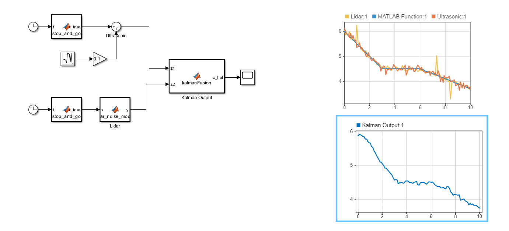
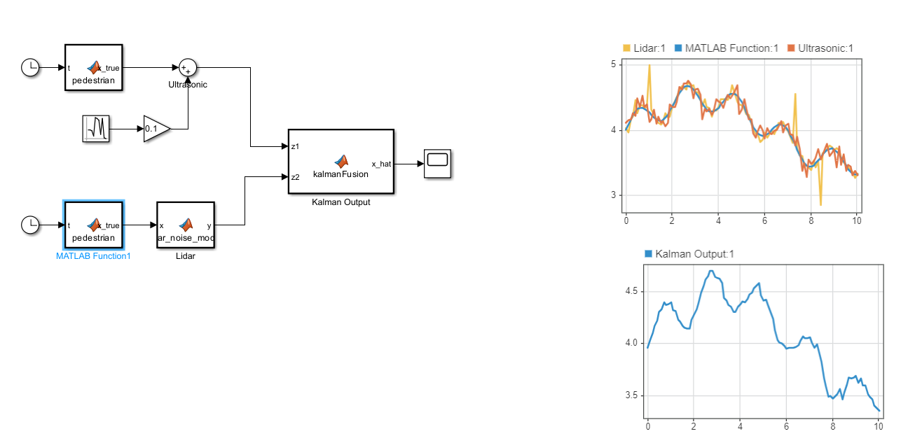

# Sensor Fusion using Kalman Filter

This project demonstrates the application of a **Kalman Filter** for fusing noisy sensor data from two simulated sources: **ultrasonic** and **LIDAR**. It includes simulation of real-world scenarios such as stop-and-go car motion and pedestrian movement, with performance evaluated using **Mean Absolute Error (MAE)**.

---

## 📌 What is a Kalman Filter?

The **Kalman Filter** is an optimal recursive data processing algorithm that estimates the state of a linear dynamic system from a series of noisy measurements. It is widely used in robotics, autonomous vehicles, and control systems for sensor fusion and state estimation.

---

## 🔄 Stages in Kalman Filter

1. **Prediction Step**  
   Estimates the current state based on the previous state and motion model.
   
2. **Update Step**  
   Corrects the estimate using the current measurement.

3. **Covariance Update**  
   Refines the uncertainty in the estimation.

Each step combines knowledge of the system dynamics and noisy sensor data to produce a better overall estimate.

---

## 🧪 Evaluation: Why MAE?

We used **Mean Absolute Error (MAE)** to evaluate the Kalman Filter performance.  
MAE is well-suited here because the LIDAR data was intentionally simulated with random spikes, and MAE handles outliers better than metrics like MSE.

---

## 🧭 Sensors Simulated

- **Ultrasonic Sensor**  
- **LIDAR Sensor**

Both sensor outputs were simulated with Gaussian noise to mimic real-world uncertainty.

---

## 🚗 Scenario 1: Stop-and-Go Car Motion

Simulated a vehicle that slows down, comes to a stop, and resumes motion again.

- **MAE:** `0.0483`
- 

---

## 🚶 Scenario 2: Pedestrian Walking Pattern

Simulated a pedestrian motion using a gradually emerging and fading sine wave to mimic walking through the sensor field.

- **MAE:** `0.0602`
- 

---

## 🔮 Future Scope

- Integration with the **MATLAB ADAS Toolbox**
- Replace simulated data with real-time sensor data from ADAS modules
- Extend to 2D/3D state estimation with multiple object tracking

